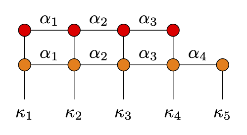

# TensorNetworkDiagrams.jl
Package to draw tensor networks. You will need to have [tectonic](https://github.com/tectonic-typesetting/tectonic) installed to compile the generated LaTeX files and [pdf2svg](https://github.com/dawbarton/pdf2svg) to convert PDFs to SVGs.

## Installation

You can install the package via the following command 

```julia
using Pkg
Pkg.add(url="https://github.com/MartinMikkelsen/TensorNetworkDiagrams")
```

## Usage

To create and visualize tensor network diagrams, you can use the following example code:

```julia
mps = MPS(4, boundary_labels = ("", ""))

save(mps, TEX("examples/mps"))
save(mps, TikZ("examples/mps"))

mpo = MPO(5, boundary_labels = ("", ""))

save(mps, TEX("examples/mpo"))
save(mps, TikZ("examples/mpo"))

save(mps, mpo, TEX("examples/mpsmpo", standalone = true))

```
After this run the follow commands in your terminal to generate the PDF files:
```bash
tectonic mps.tex
tectonic mpo.tex
tectonic MPSMPO.tex
```

